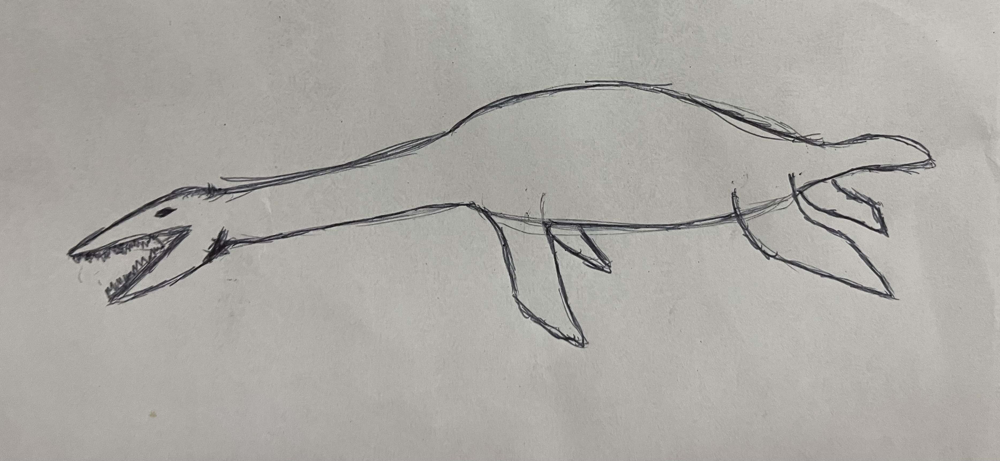
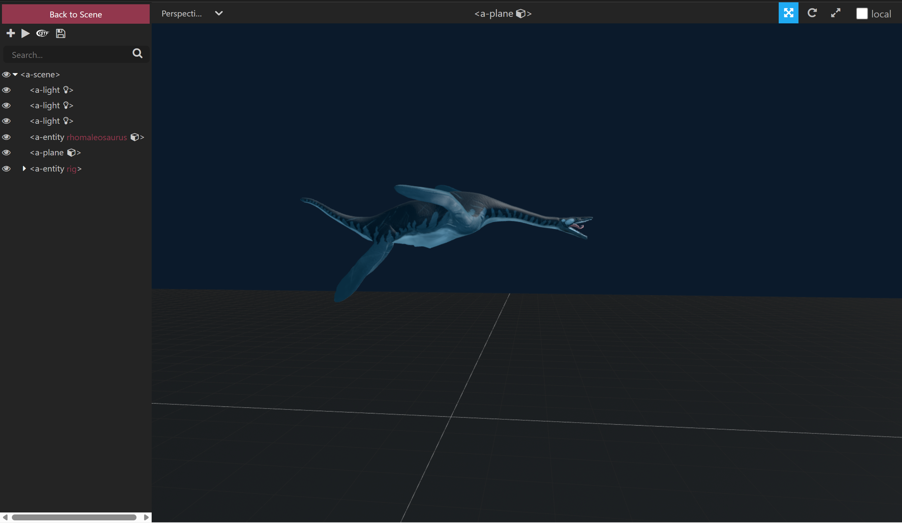
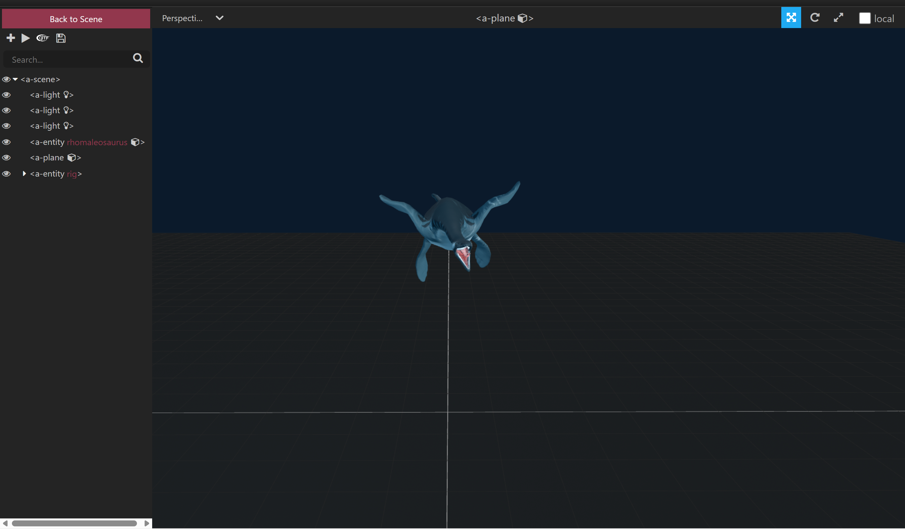

Summary of Key Interactions & Reflection

Key Interactions:
The Rhomaleosaurus Interactive Viewer presents a 3D marine reptile suspended in space, animated with lifelike swimming motion. The key interaction focuses on user immersion and observation, which allows users to orbit around the model, inspect its anatomy, and explore the environment using camera controls. The current scene includes ambient, directional, and point lighting to simulate an underwater museum-like atmosphere.
In future VR/AR iterations, the interaction will evolve into an educational mixed-reality exhibit. Users will be able to:

Trigger contextual narration or text overlays by gazing at parts of the creature (e.g., fins, jaws, spine).

Switch between “Museum Mode” (static lighting, fossils, educational text) and “Ocean Mode” (animated environment, swimming behavior).

Use hand gestures or controllers to rotate or scale the model in AR space.
For now, the animation and model act as placeholders for these planned interactive layers.

Reflection:
Working in A-Frame made it intuitive to set up the scene structure, lighting, and camera interactions. Integrating the .glb model and animation-mixer component was initially challenging, especially with handling CORS restrictions and scaling the model to match the scene’s proportions. Running a local Python server resolved the file access issue, and adjusting model positioning in the inspector helped fine-tune visibility. Once the model was animated, the project came to life, which was a rewarding moment. The biggest learning curve came from debugging file paths, lighting intensity, and relative scaling between imported assets.

Questions / Feedback Request:
This version is ready for submission, but I’m open to feedback on the following points:

Are there best practices for lighting balance in A-Frame to simulate underwater ambiance?

Would adding an animated water shader or fog element improve performance and immersion, or should that wait until the VR phase?
Overall, I consider this version complete for the assignment milestone but will continue developing environmental interactivity for future iterations.

 

 